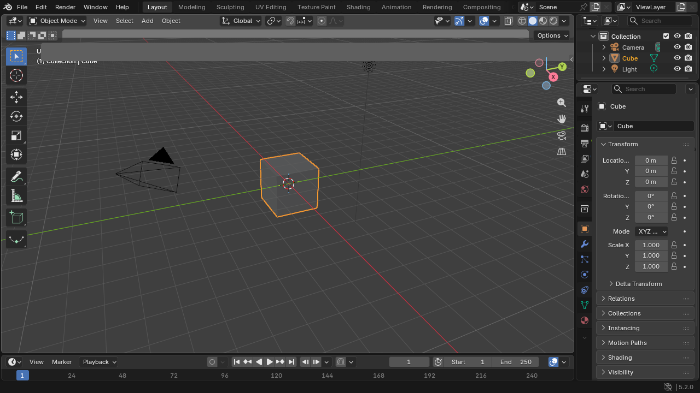
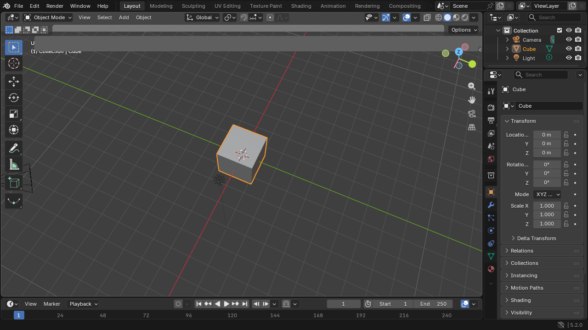
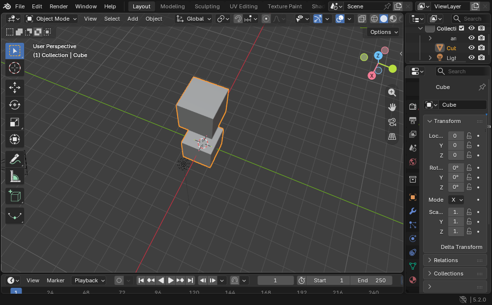

<div align="center">

# blender-web

**Blender 5.2 LTS, running natively in your browser.**

Real Blender — the actual C++ source compiled to WebAssembly, with a new WebGPU
backend written inside Blender's own GPU module. No streaming, no server-side
rendering, no rewrite. After load, it runs entirely on your device.

[](LICENSES/)
[](PROVENANCE.md)
[](#architecture)
[](../../releases)



*The real Blender 5.2 UI — menus, Outliner, Properties, viewport gizmo — in a tab.*



*Middle-mouse orbit on real hardware WebGPU.*



*Window resize now repaints the full scene correctly — verified across 6 consecutive resize cycles on real hardware.*

</div>

---

## Try it

**Hosted:** `blender.gessa.ai` — rolling out now; until it's live, run it
locally below.

**Local (2 minutes):** grab the latest [release](../../releases), then:

```bash
tar -xzf blender-web-local-*.tar.gz && cd blender-web-local
python3 serve-local.py shell bin 8080
# open http://localhost:8080 in current Chrome or Edge
```

The tiny server only adds the COOP/COEP headers SharedArrayBuffer requires.
First paint takes ~10-25s on an M-class laptop depending on shader-cache state
(development build; a ~15MB-to-interactive staged build is in flight — see the
version ledger below).

**Requirements:** desktop Chrome/Edge (current) with hardware WebGPU. After
load, kill your network — it keeps working. There is no server.

## What works today

| Area | Status |
|---|---|
| Full Blender 5.2 UI (splash, workspaces, Outliner, Properties, Timeline, menus, N/T panels) | ✅ pixel-faithful, verified on hardware |
| Workbench viewport: grid, gizmo, shaded solid, MMB orbit | ✅ |
| Edit mode: Tab, extrude with live numeric readout, standard keymap | ✅ |
| Python UI layer (`bl_ui`) on CPython 3.13 under wasm | ✅ it runs the real thing |
| `.blend` save/load, OBJ / USD / glTF export-import | ✅ verified in automated runs |
| blenlib core tests vs native | ✅ 1,667/1,667 byte-identical |
| bmesh edit-mesh suite | ✅ full upstream suite |
| Cycles CPU (small scenes) | ✅ 27/27 within Blender's own image thresholds |
| Python `bpy` suites vs pinned native oracle | ✅ 65/75 (rest tracked) |
| EEVEE viewport | ❌ not yet — the largest open GPU work |
| Window resize | ✅ fixed in v0.1.1, verified 10/10 on hardware across repeated resize cycles |
| Physics / IK / fluids / video / audio / FBX / Alembic | ❌ compiled out, tracked in the deferral ledger |

Permanently out of scope in a browser: Cycles GPU final rendering (no WebGPU
ray tracing), OSL (no JIT in the sandbox), scenes over 16GB.

## Architecture

```
Blender 5.2 LTS (pinned fbe6228777e7)
 ├─ patches/                 264-patch series against the pin (~168k lines)
 │   └─ source/blender/gpu/webgpu/   new WebGPU backend (~22k LOC)
 │        GLSL → SPIR-V → WGSL (Tint) at runtime · OPFS shader cache
 ├─ platform_web/            GHOST-web platform layer (~19k LOC)
 │        windowing · input · IME · clipboard · pointer lock · present path
 ├─ CPython 3.13 + numpy under Emscripten — the entire Python UI layer runs
 ├─ WasmFS + OPFS project storage · pthreads + PROXY_TO_PTHREAD · mimalloc
 └─ Dawn / emdawnwebgpu · mono-wasm · JSPI
```

Build it yourself: see [`SETUP.md`](SETUP.md). Provenance for every derived
file: [`PROVENANCE.md`](PROVENANCE.md).

## Built by an autonomous agent fleet

This port was driven end-to-end by AI agents working from a written spec, with
every change verified against a native Blender oracle before being claimed —
and humans directing, reviewing, and running hardware verification.

**By the numbers** (2026-08-03 → 2026-08-26):

- **~201 billion tokens** across the program (~195.7B in the interactive
  build-out phase; ~5.7B across the autonomous loop)
- **~277 million output tokens** of generated code, analysis, and receipts
- **335 autonomous iterations** on a self-directed loop (95% clean-exit rate),
  each one booting cold from the spec, picking work, verifying, committing
- **1,220 commits in 23 days**, every one carrying `Assisted-by:` trailers
- **264 patches / ~168,000 patch lines** against pinned upstream, plus a
  ~22k-line WebGPU backend and ~19k-line web platform layer written from
  scratch
- Verification-first doctrine: no claim without a test receipt; deferrals are
  ledgered with named blockers ("deferrals are honesty, silence is fraud")

A detailed methodology writeup and a live parity dashboard are next.

## Version ledger

| Version | Date | What landed |
|---|---|---|
| `v0.1.0-dev` | 2026-08-26 | First public snapshot: full UI boot on hardware WebGPU, Workbench viewport, edit mode + extrude, .blend/OBJ/USD/glTF IO, local-run kit |
| `v0.1.1` | 2026-08-27 | Window-resize repaint fix (verified 10/10 on hardware), pointer-lock hardening, minimal two-phase loading screen, widget-shadow rendering fix, payload under 15MB |
| `v0.2` | *planned* | Staged loading: ~15MB to first interactive viewport, service-worker precache |
| `v0.3` | *planned* | EEVEE's first verified pixels; parity dashboard goes live |

Known issues and excluded features are tracked with named reasons in the
project ledger; the deferral registry publishes with the parity dashboard.

## Conformance and reproducibility

Current conformance status and the complete named limitation registry are
published in [`PARITY.md`](PARITY.md), generated from committed receipts and
ledger data. A green subsystem result does not imply the complete launch
gate — see `LAUNCH.md` in the repo for the full bar.

`scripts/package-tagged-release.py` produces the release archive and a
machine-readable sidecar receipt only from an annotated release tag at a
clean `HEAD`, a strict-pass split manifest, and the exact derived staged
bundle — it records every shipped byte, the source commit and tree, the
canonical upstream replay, and the accepted hardware-profile provenance.
Diagnostic (`CAPTURE`) generations are deliberately rejected and cannot be
packaged as releases.

## License and trademark

GPL — every derived file keeps its upstream SPDX header plus a provenance line
(`reuse lint` green across the tree; see [`LICENSES/`](LICENSES/),
[`THIRD-PARTY.md`](THIRD-PARTY.md), [`NOTICE`](NOTICE)).

This project is **not affiliated with, endorsed by, or sponsored by the
Blender Foundation**. Blender® is a registered trademark of the Blender
Foundation. This is an independent, source-derived port of Blender's
open-source (GPL) code — built with a lot of respect for the Blender Authors
and three decades of the real thing.
