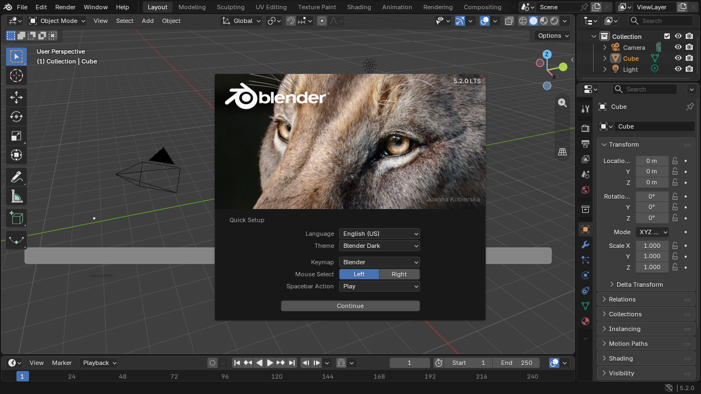
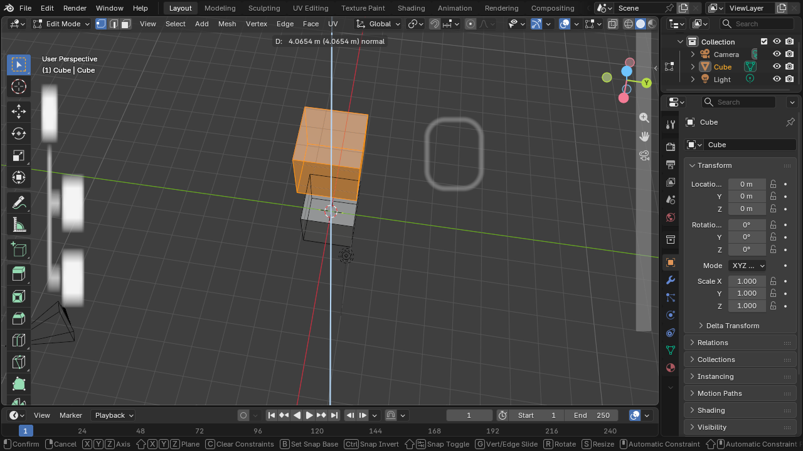

# blender-web

**Blender 5.2 LTS, running natively in your browser.** Real Blender — the actual
C++ source, compiled to WebAssembly — with a new WebGPU backend written inside
Blender's own `gpu` module, a browser platform layer (GHOST-web), WasmFS/OPFS
file storage, and CPython 3.13 running the full Python UI layer. No streaming,
no server-side rendering: after the files load, it runs entirely on your
device.



*The real thing: modal extrude with numeric readout, edit mode, full keymap —
in a tab.*



## Run it locally (2 minutes)

Grab the latest [release](../../releases), then:

```bash
tar -xzf blender-web-local-*.tar.gz && cd blender-web-local
python3 serve-local.py shell bin 8080
# open http://localhost:8080 in current Chrome or Edge
```

The server just adds the `Cross-Origin-Opener-Policy` / `Cross-Origin-Embedder-Policy`
headers that SharedArrayBuffer (pthreads) requires. `localhost` is a secure
context, so no TLS needed. First paint takes ~25s on an M-class laptop (this is
a development build; staged/streaming loading is in progress — see status).

Requirements: a browser with WebGPU on real hardware (current Chrome/Edge;
Apple Silicon, and discrete/integrated GPUs with proper drivers). Desktop only
for now.

## What works today (verified on hardware)

- Boot to the complete Blender 5.2 UI: splash, workspaces, Outliner,
  Properties, Timeline, N/T panels, menus — pixel-faithful, real fonts, real
  theme
- Workbench viewport: grid, gizmo, shaded solid mode; middle-mouse orbit;
  camera/light/cube scene
- Edit mode: Tab, extrude (E) with live numeric readout, the standard keymap
- The Python layer is real: the entire menu/panel UI is Blender's own
  `bl_ui` Python running on CPython 3.13 under wasm
- Files: OPFS-backed project storage; `.blend` save/load; OBJ/USD/glTF
  export-import (verified in automated runs)
- CPU test parity vs native Blender: 1,667/1,667 blenlib gtests byte-identical;
  full bmesh edit-mesh suite; 27/27 Cycles-CPU small-scene renders within
  Blender's own thresholds; 65/75 Python `bpy` suites against a pinned native
  oracle

## What doesn't (honesty section)

This is a development snapshot of an active port, not a finished product:

- **EEVEE is not working yet** — the viewport is Workbench; EEVEE is the
  largest open GPU work
- **Resizing the browser window blanks the canvas** until your next
  click/mouse-move (fix landed upstream, next release)
- First load is heavy (~290MB uncompressed dev build); a profile-split staged
  build (~15MB to interactive) is in progress
- Permanently out of scope in a browser: Cycles GPU final rendering (no WebGPU
  ray tracing), OSL (no JIT in the sandbox), scenes >16GB
- Currently compiled out: IK solvers, rigid-body/physics (Bullet), fluids
  (Mantaflow), video (FFmpeg), audio, FBX, Alembic, motion tracking, and other
  items — each tracked with a named reason in `ledger` (deferral registry
  publishes with the parity dashboard)
- Arbitrary huge `.blend` files may not open on wasm32 yet (64-bit block
  pointer truncation is a known, tracked limit)

## How it's built

- `patches/` — the complete patch series against pinned upstream
  **Blender `blender-v5.2-release` @ `fbe6228777e7`** (see `PROVENANCE.md`)
- `platform_web/` — GHOST-web platform layer (windowing, input, IME,
  clipboard, pointer lock, WebGPU surface/present) and the browser shell
- The WebGPU backend lives in the patch series as
  `source/blender/gpu/webgpu/` — Blender's `GPUBackend` implemented on Dawn
  `webgpu.h`, shaders translated GLSL → SPIR-V → WGSL (Tint) at runtime with an
  OPFS shader cache
- Emscripten: mono-wasm, pthreads + PROXY_TO_PTHREAD, mimalloc, WasmFS+OPFS,
  JSPI; built via the recipes in `scripts/` (see `SETUP.md`)

Development is heavily AI-assisted (an autonomous agent fleet doing
verify-before-claim iterations against a native Blender oracle, with every
change carrying `Assisted-by:` trailers) and human-directed and reviewed. A
detailed methodology writeup is coming with the parity dashboard.

## License and trademark

GPL — every derived file keeps its upstream SPDX header plus provenance line
(`reuse lint` green across the tree; see `LICENSES/`, `THIRD-PARTY.md`,
`NOTICE`). This project is **not affiliated with, endorsed by, or sponsored by
the Blender Foundation**. Blender® is a registered trademark of the Blender
Foundation. This is an independent, source-derived port of Blender's
open-source (GPL) code, grateful to the Blender Authors for three decades of
the real thing.
